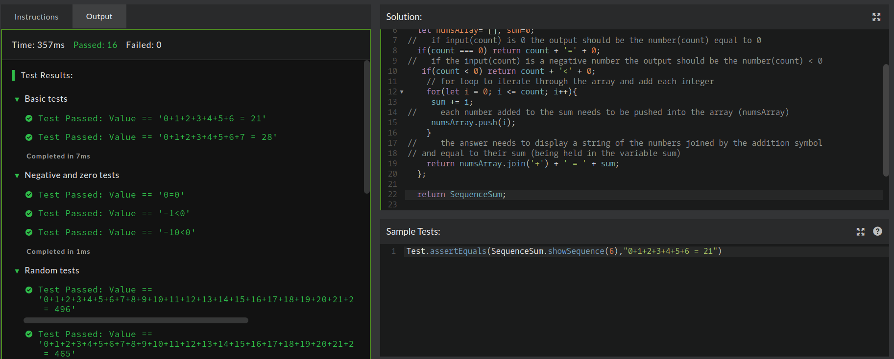

## CodeWars Challenge- 12

*Description:*

We want to generate a function that computes the series starting from 0 and ending until the given number following the sequence:

0 1 3 6 10 15 21 28 36 45 55 ....

which is created by

0, 0+1, 0+1+2, 0+1+2+3, 0+1+2+3+4, 0+1+2+3+4+5, 0+1+2+3+4+5+6, 0+1+2+3+4+5+6+7 etc..

Input:

LastNumber

Output:

series and result

*Examples Given:*
1. Input:6
Output:

0+1+2+3+4+5+6 = 21

2. Input: -15
Output:
-15<0

3. Input: 0
Output:
0=0

If array is empty, null or None, or if only 1 Element exists, return 0.

Note:In C++ instead null an empty vector is used. In C there is no null. ;-)

## Solved Using:

1. JavaScript
